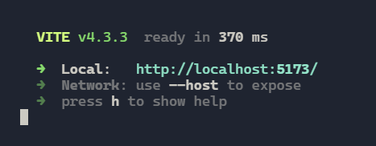
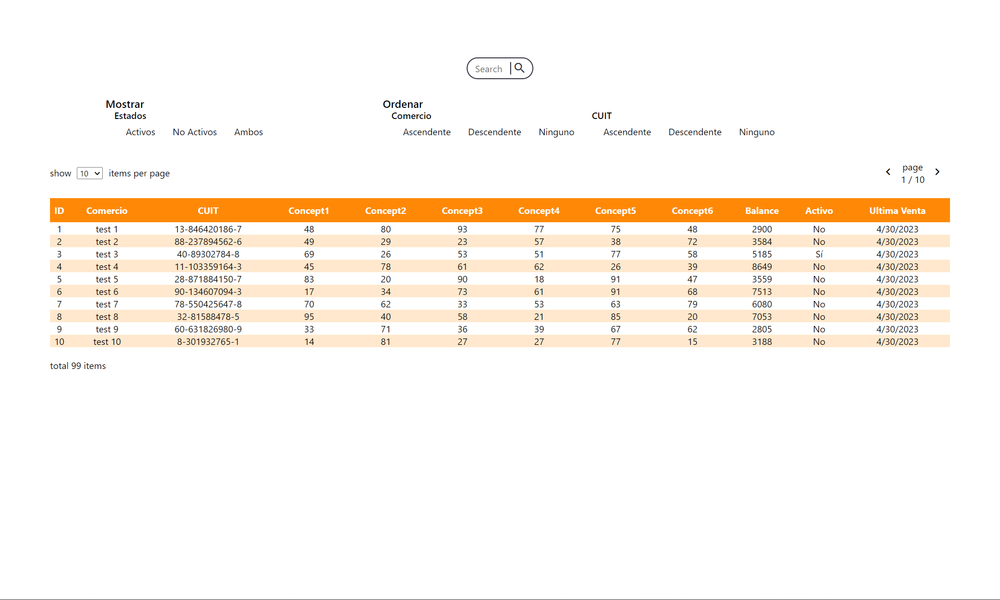
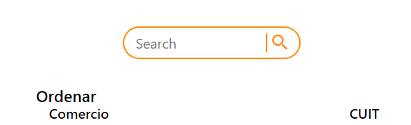
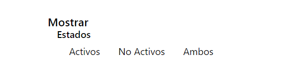
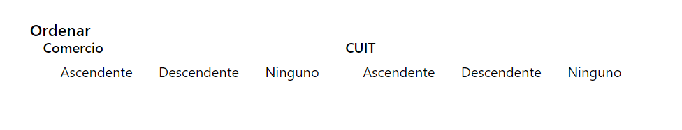
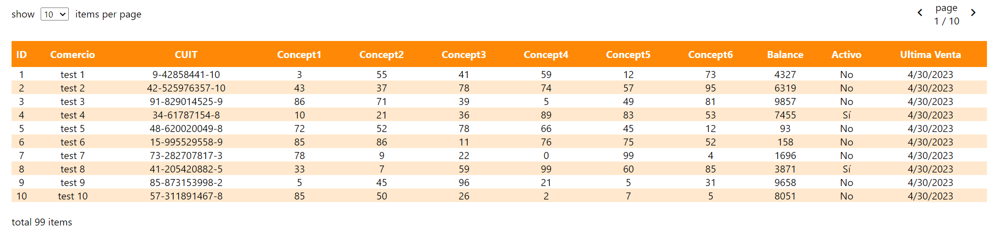

# Table Visualize

## **About**

Made in react using Typescript and Sass, this project visualize data received from an API. To simulate the API, the project has
features as, queries, filters, and sorting. Also the table in segmented in pages and the user can navigate
along the pages and define the number of items shown in each page.
<br/>
In the console are shown the url to send the request to the api, being the base url: https://api.koibanx.com/stores the api follows the [RestDB.io standards](https://restdb.io/docs/querying-with-the-api#restdb) to make the queries and sorting.
<br/>
It is assumed that the response of the API will be in the next form

```json
{
    "data": [
        {
            "id": "0001",
            "commercio": "test 1",
            "cuit": "00-00000000-0",
            "conceptos": [1,2,3,4,5,6],
            "balance": 1234234,
            "active": 1
            "ultima venta": DD/MM/YYYY
        },
        ...
    ]
}
```

concepts will be received in form of a numeric array instead of the each concept individually, the date will be in `Date()` javascript object. Since the API is simulated, the api response is not parsed, instead is pre-builded in the [data](./src/api/data.ts) file. Also the sorting and the filtering will be made in the [api](./src/api/api.ts). Segmenting the table in pages will be made by the front end to avoid calling the api too many times.

## **Installation and Run**

After cloning the repository follow the following command to install the dependencies

```
npm i
```

then execute the project by running the following command

```
npm run start
```

## **Usage**

Once you running `npm run start` click on the link http://localhost:5173/ (port may change from computer to computer) that appears in the command line
<br />

<br/>
After opening the project in the preferred browser, you should be able to see the following view
<br/>

<br />

## Make a Query

To make a query, type the desired value in the search text input. This will make the query 500ms after the user stop typing.
<br/>

<br />
this will search if the query exists in a substring of the ID, Commerce name or inside the CUIT.

## Filter by Active State

To filter the date by active and non-active, select an option bellow the filter section
<br />

<br />
by default non filter is applied, the option "Ambos" will be the same as no filter applied.

## Sort the content

The user can sort the data by commerce name and CUIT, in ascending, descending or not. the
sorting can be mixed. Just select one option bellow the sorting field section
<br/>

<br/>

## Table Navigation

Finally the user can change the items per page at the top left of the table, and navigate along the pages in the navigation buttons at the top right of the table.
<br />

<br />
